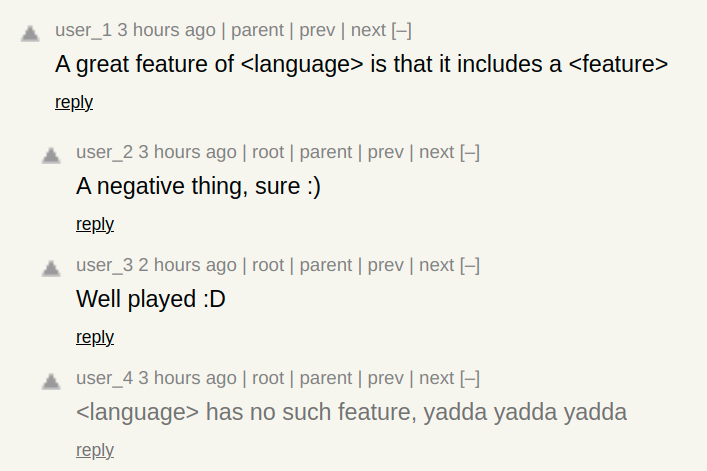
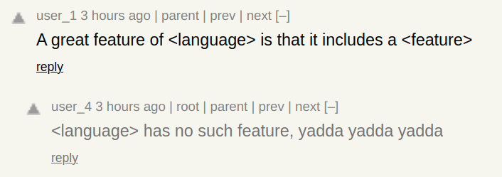

# hn_glasses

Model for predicting low infomation comments on Hacker News. After classifying information as low quality, user can use a browser extension to remove those comments and its children.

Before:

After:

